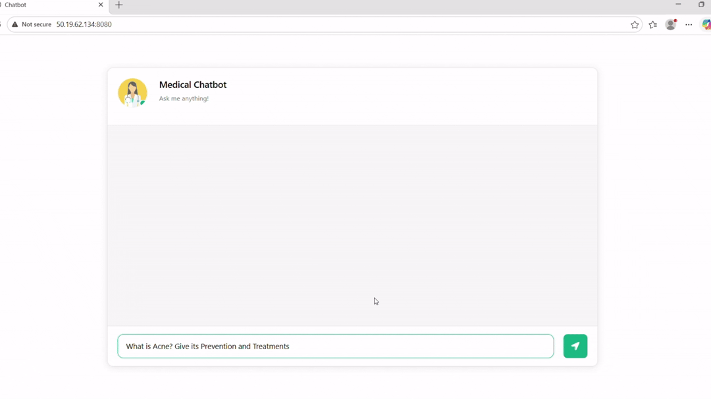
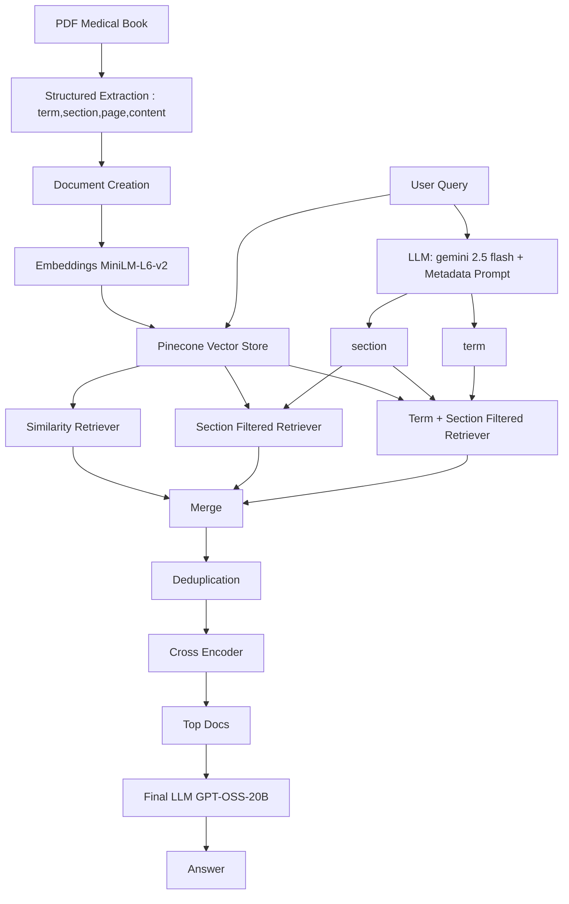
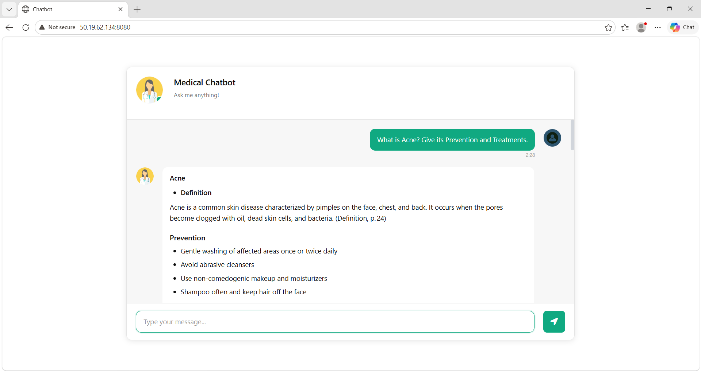
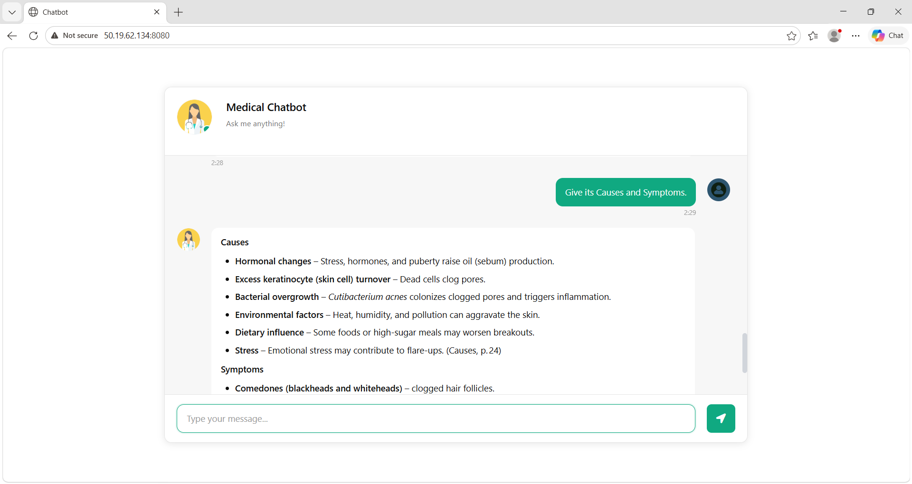
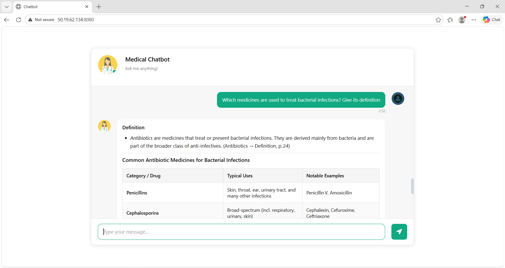
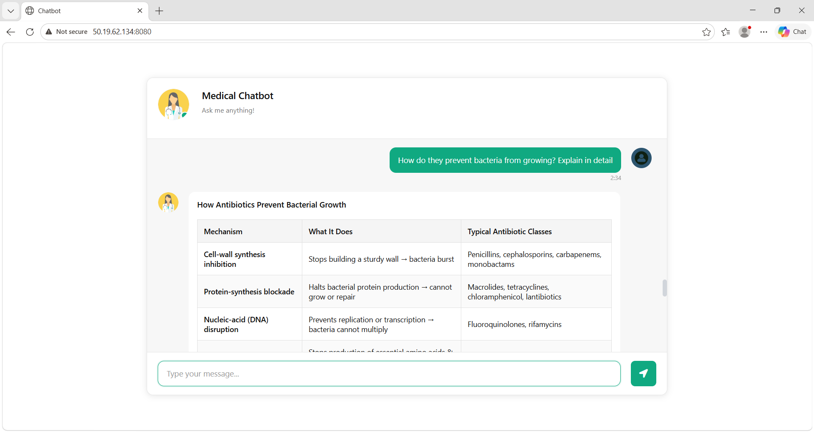
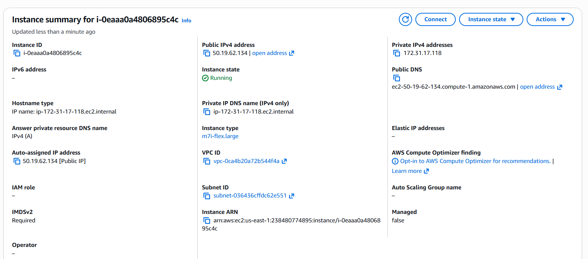
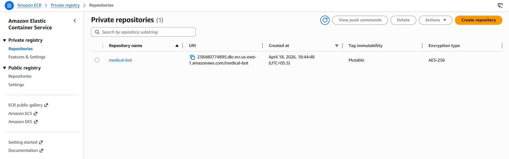
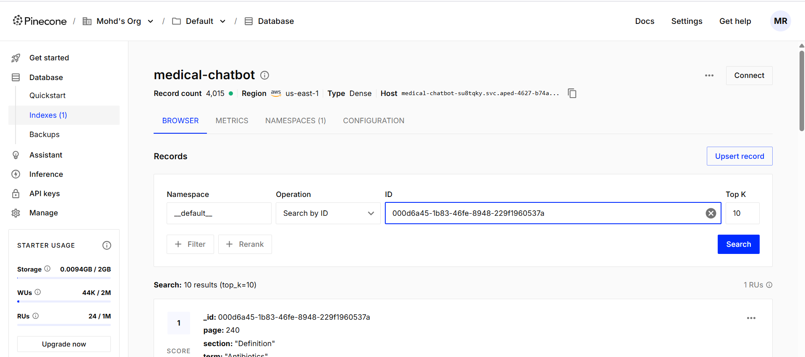

# Medical-Chatbot-with-LLM-RAG-Langchain-Pinecone-Flask-AWS

An end-to-end **Retrieval-Augmented Generation (RAG)** based medical chatbot that provides **accurate, context-aware answers** using a structured medical knowledge base.

The system combines:

* 📚 Structured document processing (term + section aware)
* 🔍 Hybrid retrieval (semantic + metadata filtering)
* 🧠 LLM-powered query understanding
* ⚡ Re-ranking for high-quality responses
* ☁️ Production deployment using AWS (EC2 + ECR + CI/CD)

---

## 🎥 Demo

Running on AWS IP address wth port 8080



---

## 🚀 Features

* ✅ **Structured RAG Pipeline** (term + section based retrieval)
* ✅ **Conversational Memory Support** (handles follow-up queries like “its treatment”)
* ✅ **Hybrid Retrieval Strategy**

  * Semantic similarity
  * Section filtering
  * Term + Section filtering
* ✅ **Cross-Encoder Re-ranking** for improved relevance
* ✅ **Production Deployment on AWS**
* ✅ **CI/CD using GitHub Actions**
* ✅ **Clean, Structured Outputs (with sections & citations)**

---

## 🧠 RAG Pipeline Architecture



---

## 📂 Project Structure

```bash
.
├── app.py                  # Flask app (frontend + API)
├── main.py                 # RAG pipeline (retrieval + generation)
├── Dockerfile              # Containerization
├── requirements.txt
├── .github/
│   └── workflows/
│       └── cicd.yaml       # CI/CD pipeline
├── src/
│   ├── prompt.py           # Metadata + system prompts
│   ├── helper.py            # Helper functions (dedup, rerank, etc.)
│   ├── section_set.txt     # Allowed sections
│   └── term_set.txt        # Medical terms (A–B)
├── data/
│   └── Medical_book.pdf    # Source data
├── templates/
│   └── chat.html           # UI
├── static/
│   └── style.css
├── images/
│   ├── Acne_1.png
│   ├── Acne_2.png
│   ├── Antibiotic_1.png
│   ├── Antibiotics_1.png
│   ├── AWS_EC2.png
│   ├── AWS_ECR.png
│   └── Pinecone.png
└── README.md
```

---

## 🔍 Example Outputs

### 🧴 Acne

<table>
<tr>
<td></td>
<td></td>
</tr>
</table>

---

### 💊 Antibiotics

<table>
<tr>
<td></td>
<td></td>
</tr>
</table>

---

## 🧠 Intelligent Query Handling

### Example:

```text
User: What is Acne?
User: What are its symptoms?
User: Give its treatment
```

👉 The system:

* Tracks conversation context
* Resolves “its” → Acne
* Retrieves correct sections
* Returns structured response

---

## ⚙️ Tech Stack

* **LLMs**

  * Gemini 2.5 Flash → Metadata extraction
  * GPT-OSS-20B → Final answer generation

* **Embeddings**

  * sentence-transformers/all-MiniLM-L6-v2
 
* **Re-ranking**
  * Cross Encoder (cross-encoder/ms-marco-MiniLM-L-6-v2)

* **Vector Database**

  * Pinecone

* **Framework**

  * LangChain

* **Backend**

  * Flask

* **Deployment**

  * AWS EC2 + Docker + ECR

---

## ☁️ AWS Deployment

### 🖥️ EC2 Instance



---

### 📦 Docker Image (ECR)



---

### 🔍 Vector Database (Pinecone)



---

## 🔄 CI/CD Pipeline

* GitHub Actions builds Docker image
* Pushes to AWS ECR
* EC2 pulls latest image
* Runs container automatically

---

## 🧪 Key Improvements Over Basic RAG

* ❌ Naive chunking → ✅ Structured document parsing
* ❌ Single retriever → ✅ Hybrid retrieval
* ❌ No ranking → ✅ Cross-encoder re-ranking
* ❌ Stateless queries → ✅ Context-aware conversations

---

## ⚠️ Limitations

* Dataset currently limited to **A–B medical terms**
* Some implicit queries may require query rewriting
* Performance depends on embedding quality

---

## 🚀 Future Improvements

* 🔄 Query rewriting for better context resolution
* 📊 Evaluation metrics for retrieval quality
* ⚡ Caching for faster responses
* 🌐 Domain expansion beyond A–B

---

## 📌 How to Run Locally

### 1. Clone the Repository
```bash
git clone <repo>
cd medical-chatbot
```

### 2. Create `.env` File

Create a `.env` file in the root directory and add:

```env
AWS_ACCESS_KEY_ID=your_key
AWS_SECRET_ACCESS_KEY=your_key
AWS_DEFAULT_REGION=your_region
ECR_REPO=your_repo_name
PINECONE_API_KEY=your_key
OPENAI_API_KEY=your_key
GOOGLE_API_KEY=your_key
```

### 3. Install Dependencies

```bash
pip install -r requirements.txt
```

### 4. Create Vector Store

```bash
python store_index.py
```

### 5. Run the Application

```bash
python app.py
```
---

## 📈 Why This Project Stands Out

* Demonstrates **production-grade RAG system**
* Combines **LLMs + retrieval + ranking**
* Shows **real-world deployment (AWS + CI/CD)**
* Handles **multi-turn conversational queries**

---

## 👨‍💻 Author

Mohd Rushan
Final Year Student | Aspiring Data Scientist

---

## ⭐ If you found this useful, consider starring the repo!
